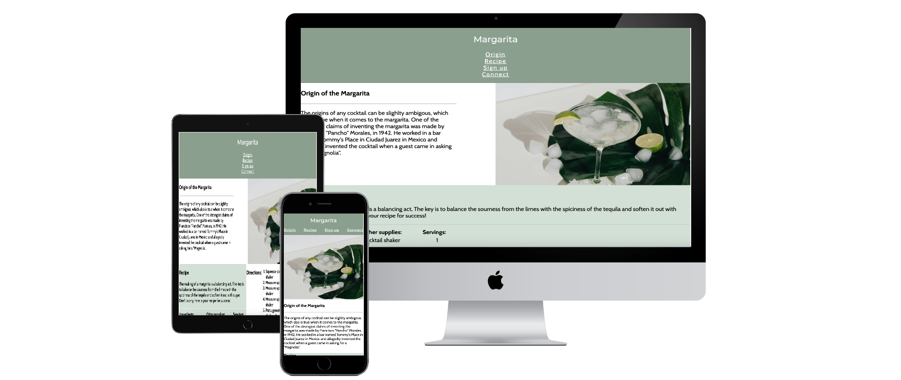

# Introduction
---
# Margarita Recipe Page

Recipe page - This is a page with a recipe of a margarita and a brief description of where the cocktail originated from 

This was created as margarita is a very popular cocktail and it is easy to make, which not everyone realises. Therefore a simple but yet clear page for the making of a margarita was made here. 

This page can be used by anyone who is interested in making a margarita. 

## Features 

### - Navigation

- The Header includes a navigation bar, that takes you to the different sections of the page (Origin, Recipe, Subscribe, Connect)
- The navigation links are underlined to make it clear that they are clickable 
- The navigation bar has a green background with a white colored font 

### - The Header

- The Header includes a title which says 'Margarita', stating that this is a page about a margarita cocktail
- The Header has a color scheme that sets the tone of the page, with green and white. 
- In The Header you can clearly see that this is a recipe website with some additional information about margaritas

## - Origin 

- The Origin section provides a short background story about the history of the margarita

## - Recipe 

- The recipe section provides a margarita recipe, with the ingredients and supplies visualised in a table 
- The directions for the making of the drink is visualised in an ordered list, to make it clear that the steps needs to be followed in order 

## - Subscribe 

- In the subscribe section, there is a sign up form to subscribe to get more margarita recipes 
- The form collects your name and email adress
- The form adds an element of interaction to the recipe page 

## - Connect 

- The footer of the page contains social media links 
- The social media links navigates to the social media pages of the European Bartender School 
- This is for the users that might be more interested in disocvering cocktail making

